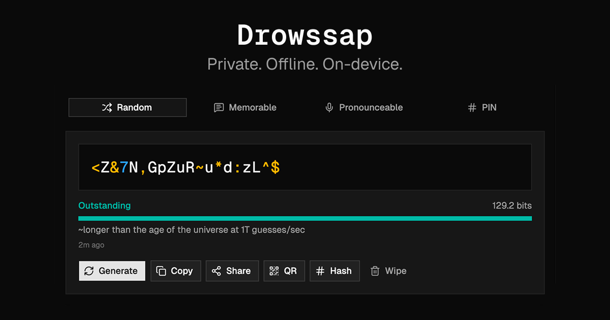

<div align="center">
  <a href="https://drowssap.joserosendo.dev">
    
  </a>
  
  # Drowssap
  
  **One command. Your entire AI skill stack. Installed.**
  
  [https://drowssap.joserosendo.dev](https://drowssap.joserosendo.dev)
</div>

<br />

A privacy-first password generator that runs entirely in your browser. No data ever leaves your device.

**Drowssap** is "password" spelled backwards.

## Features

- **Four generation modes** — Random, Memorable (passphrase), Pronounceable, and PIN
- **Cryptographically secure** — Uses the Web Crypto API exclusively. `Math.random()` is never used. Rejection sampling eliminates modulo bias.
- **Strength analysis** — Entropy calculation, crack-time estimation, and an 8-tier strength indicator
- **SHA-256 hashing** — Generate and inspect a hash of your password
- **QR code generation** — Scan a password onto your phone
- **Share support** — Native Web Share API when available
- **Keyboard shortcuts** — `⌘G` to generate, `⌘C` to copy, `Esc` to close panels
- **Dark/light/system theme** — Respects your preference
- **Installable PWA** — Works offline as a standalone app
- **Accessibility** — Screen-reader-friendly with ARIA live regions

## Tech Stack

- **React 19** + **TypeScript**
- **Vite** with PWA plugin
- **Tailwind CSS v4**
- **shadcn/ui** (Base UI + Radix primitives)
- **Vitest** + Testing Library

## Getting Started

```bash
# Install dependencies
bun i

# Start dev server
bun dev

# Run tests
bun run test

# Build for production
bun run build
```

## Architecture

```
src/
├── lib/
│   ├── generator/     # Password generation logic per mode
│   ├── crypto.ts      # Secure randomness (Web Crypto API)
│   ├── strength.ts    # Entropy calculation & crack-time estimation
│   ├── charsets.ts    # Character pool building & validation
│   ├── hash.ts        # SHA-256 hashing via Web Crypto API
│   ├── clipboard.ts   # Clipboard read/write with auto-clear
│   ├── share.ts       # Web Share API integration
│   ├── sound.ts       # Audio feedback on generation
│   └── storage.ts     # Settings persistence (localStorage)
├── hooks/             # React hooks for state, clipboard, keyboard shortcuts
├── components/        # UI components (display, controls, modals)
└── data/              # EFF wordlist for passphrase generation
```

## Security

- All randomness comes from `crypto.getRandomValues()` — the browser's CSPRNG
- Passwords are generated and displayed locally; no network requests are made
- A strict Content Security Policy is enforced via `<meta>` tag
- Clipboard can be automatically cleared after a timeout
- The "Wipe" button clears all in-memory state, hashes, and modals

## License

This work is distributed under the [GNU General Public License 3.0 (GPL)](license) License.

See [license](license) for more information.
